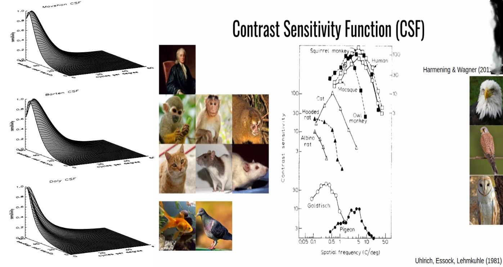
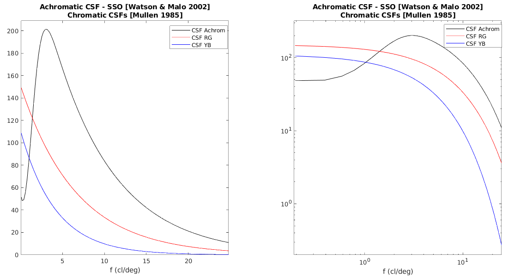
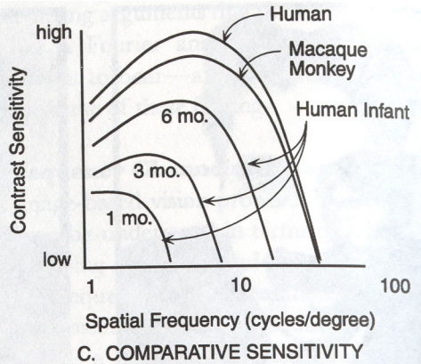
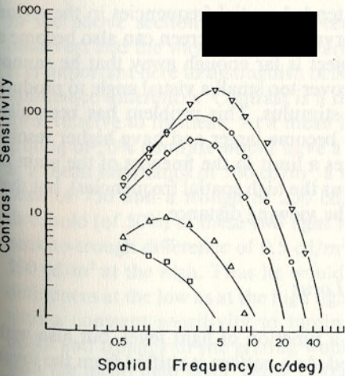
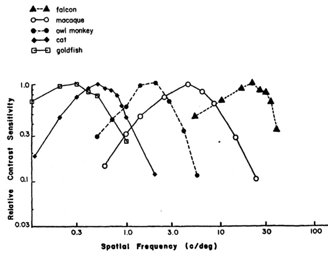
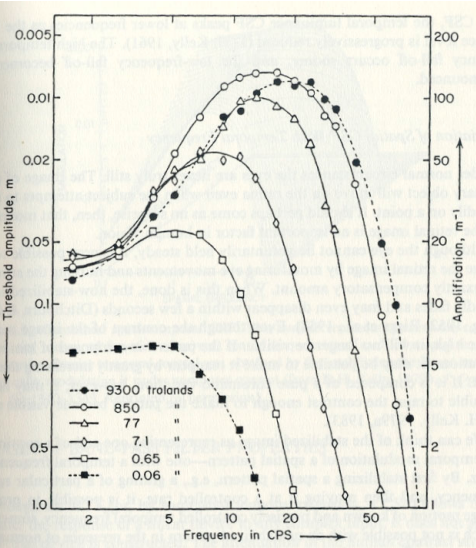

# CSFpy

### The various of Contrast Sensivity Function (CSF) models  
  
  
  
  
  
  
  
  

#### If you think this project can help you then please consider cite below papers: 

```
@inproceedings{Watson02,
author = {Watson, Andrew and Malo, Jesús},
year = {2002},
month = {02},
pages = {III-41 },
title = {Video quality measures based on the standard spatial observer},
volume = {3},
isbn = {0-7803-7622-6},
journal = {Proceedings / ICIP ... International Conference on Image Processing},
doi = {10.1109/ICIP.2002.1038898}
}
```

```
@article{Watson10,
author = {Watson, Andrew and Ahumada, Albert},
year = {2010},
month = {01},
pages = {51-51},
title = {The Spatial Standard Observer},
volume = {4},
journal = {Journal of Vision - J VISION},
doi = {10.1167/4.8.51}
}
```

```
@article{Mullen85,
author = {Mullen, Kathy},
year = {1985},
month = {03},
pages = {381-400},
title = {The contrast sensitivity of human color vision to red-green and blue-yellow chromatic gratings},
volume = {359},
journal = {The Journal of physiology},
doi = {10.1113/jphysiol.1985.sp015591}
}
```


```
@inproceedings{Daly1992TheVD,
  title={The visible difference predictor: An algorithm for the assessment of image fidelity},
  author={S. Daly},
  year={1992}
}
```

```
@misc{li2021hvsoriented,
      title={A Psychophysical Oriented Saliency Map Prediction Model}, 
      author={Qiang Li},
      year={2021},
      eprint={2011.04076},
      archivePrefix={arXiv},
      primaryClass={cs.CV}
}
```

[Barten CSF in (1999)](https://pure.tue.nl/ws/files/1613279/9901043.pdf)

#### If you have any questions, please contact me.
